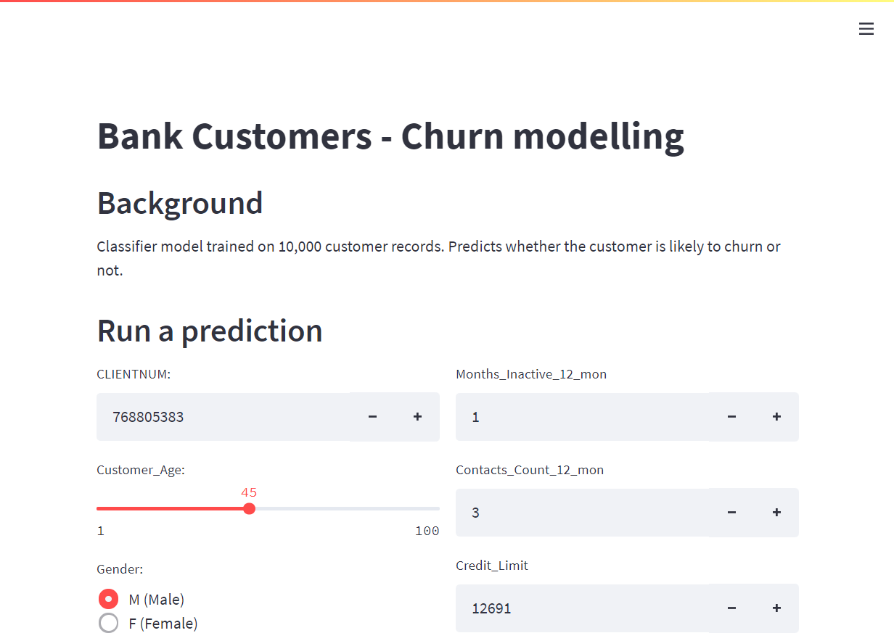

# Bank customers - churn modelling
Churn modelling project for bank customer dataset.

## Code overview:
- `churn_analysis.ipynb` - Notebook containing the full modelling process including data cleaning, exploration, model training and evaluation
  - A trained version of the best model was exported as `model.pkl`
- `app/clf_funcs.py` containing
  - `classify()` function which loads the pre-trained model above, and predicts churn status on a single customer record.
- `app/app_deploy.py` which is an interactive web-app
  - Included to allow easy access to model inference.
  - The web-app is online at [share.streamlit.io/adin786/](https://share.streamlit.io/adin786/bank_churn/main/app/app_deploy.py)
  - Or can be run locally, as below

## How to run the code
### From the command line
To classify a single customer record you need to first create a clean conda environment using the `environments.yaml` file.  Run the following commands from the anaconda prompt to activate the environment and open a python REPL:
```bash
conda env create --name bank_churn_model --file environment.yml
conda activate bank_churn_model
python
```

Then you can import and run the classify function using:
```python
>>> from app.clf_funcs import classify, OrdinalEncoder_custom
>>> classify(
        CLIENTNUM=768805383,
        Attrition_Flag='Existing Customer',
        Customer_Age=45,
        Gender='M',
        Dependent_count=3,
        Education_Level='High School',
        Marital_Status='Married',
        Income_Category='$60k - 80k',
        Card_Category='Blue',
        Months_on_book=39,
        Total_Relationship_Count=5,
        Months_Inactive_12_mon=1,
        Contacts_Count_12_mon=3,
        Credit_Limit=12691,
        Total_Revolving_Bal=777,
        Avg_Open_To_Buy=11914,
        Total_Amt_Chng_Q4_Q1=1.335,
        Total_Trans_Amt=1144,
        Total_Trans_Ct=42,
        Total_Ct_Chng_Q4_Q1=1.625,
        Avg_Utilization_Ratio=0.061
    )
```

The result in this case should be returned as:
```python
False
```
### From the web-app
The model can be run through a web-app with no installation at [this link](https://share.streamlit.io/adin786/bank_churn/main/app/app_deploy.py)

Otherwise the web-app can be run on localhost once the above conda environment is installed, by opening an anaconda prompt and executing the below commands.

```bash
conda activate bank_churn_model
streamlit run app/app_deploy.py
```



## ADDITIONAL QUESTIONS:
### Which machine learning models did you consider and why?
I considered the following models:
- **Logistic Regression**
- **SGD classifier (using 'log' loss)**
- **Decision Tree**
- **Random Forest**
- **XGBoost**

### What are the pros and cons of using each of these models?
- **Logistic Regression**.  This is a simple, explainable model.  Simply learns a series of +ve and -ve feature weights, which are intuitive to "explain" the relationships that the model has learned from the dataset.  Could be useful to identify critical features affecting churn rates.  This model also outputs a class probability prediction, which could be useful if we need to tweak decision thresholds if, for example we wanted to prioritise recall over precision.  Weaknesses are that it is a linear model, and can't learn complex interactions unless we introduce higher order features like polynomial terms etc.

- **SGD classifier (using 'log' loss)**.  This is basically a logistic regression but using stochastic gradient descent as the learning algorithm.  It computes the loss gradients over a subset of the data rather than over the whole dataset.  This makes it very computationally efficient, complexity is linear with the number of samples.  This model type could be useful for vastly larger datasets to allow out-of-core learning.  Disadvantages include that it is sensitive to feature scaling.

- **Decision Tree**.  Useful for baseline comparison. Not likely to learn a very accurate model using a single decision tree and it is prone to over-fitting, but it is highly explainable, doesn't require feature scaling and serves as foundation for the next few model types considered.  Weaknesses include that decision boundaries are always made of orthogonal lines, and that decision trees are easily biased by class imbalance.

- **Random Forest**.  An ensemble of many trees which reduces variance/overfitting and produces well generalised results.  Each individual tree in the "forest" can be trained in parallel, and the result is averaged over these.  Disadvantages are that random forests can be slower to train than other methods (was slowest in this project), but this will be sensitive to the number of trees etc as a hyperparameter.

- **XGBoost**.  A boosting method that trains a series of successive tree models, each one learning to minimise the residuals of the previous model.  This model is efficient to compute, considering the complexity of the relationships it learns.  I found it to produce high accuracy in it's base untuned form, and generalised well on testing data (and during cross validation).  Disadvantages include that as a tree-based method, it is not so effective for extrapolation.  Fortunately, in this problem of customer churn, extrapolation is not likely to be a strong focus of this model.

### What criteria did you use to decide which model was the best?
I considered metrics:
- Accuracy
- precision/recall
- F1 score
- AUC
- Mean and std_dev of cross validation scores (accuracy)
In this project I mainly looked for good f1 scores, since the plain *accuracy* metric is heavily skewed by the class imbalance in the raw data.

### Would you change your solution in any way if the input dataset was much larger (e.g. 10GB)?
If I was prioritising computation efficiency on a much larger dataset I would consider tuning the stochastic gradient descent model further as it should be possible to make it just as good as regular Logistic Regrssion, and with it's linear time complexity, was the most efficient to train.

However XGBoost is particularly optimised for fast, parallelisable training so I would try it's inbuilt options to handle out-of-core learning.  It could be trained on a cluster of multiple computers to aid training time, though 10Gb is probably near the threshold where distributed computing just starts to become worthwhile. 

If the dataset was so large, I would also consider trying a deep-learning method.  Neural networks can learn very complex relationships from highly dimensional data, but work best when the dataset is much larger (than say the provided 10,000 records).

Also, if the dataset was 10Gb I would prefer to store and query it from a SQL  database etc.  CSV files are useful and highly portable, but are not optimised for large datasets like SQL databases are, which would make data cleaning and exploraion much easier at that scale.

### How would you approach this challenge if the input dataset could not fit in your device memory?
As previous, I would look to employ a parallelisable/distributable model that allows out-of-core learning.  XGBoost could work for this, while also being the highest performing model tested.  (with more time I would have tried tuning each model, but so far have only considered baseline performance with default hyperparameters).

Again, I would look to store and query the data from something like a SQL database.  

Pandas dataframes require to be loaded completely into memory at once, so if the dataset simply did not fit into memory, I would need to approach the way data is loaded differently.
1. "chunked" loading of dataset, using generator functions etc to read data in line by line etc
2. Try an alternative library such as `PySpark` or `Dask`.  These enable "lazy" computation, where data is loaded and processed only as much as needed.  This makes it possible to process datasets bigger than the available RAM.  PySpark and Dask are also suitable for distributed computing across a cluster etc.

### What other considerations would need to be taken into account if this was real customer data?
If this was real customer data, I would want to consider the source of data and whether extra measures should be taken to anonymise, protect privacy in the dataset.

I would also want to consider factors like other demographic, geographic influences on the biases in this dataset.  This data looks like it is in dollars so probably covers US customers.  The classifier trained on this data might not generalise to other regions etc.

From an AI ethics point of view, I would want to ensure that the model does not inadvertently start penalising people unfairly, based on particular demographics or operator induced biases.  In this project however it seems that the purpose is only for predicting churn, so the negativeconsequences of incorrect predictions are probably relatively minor.